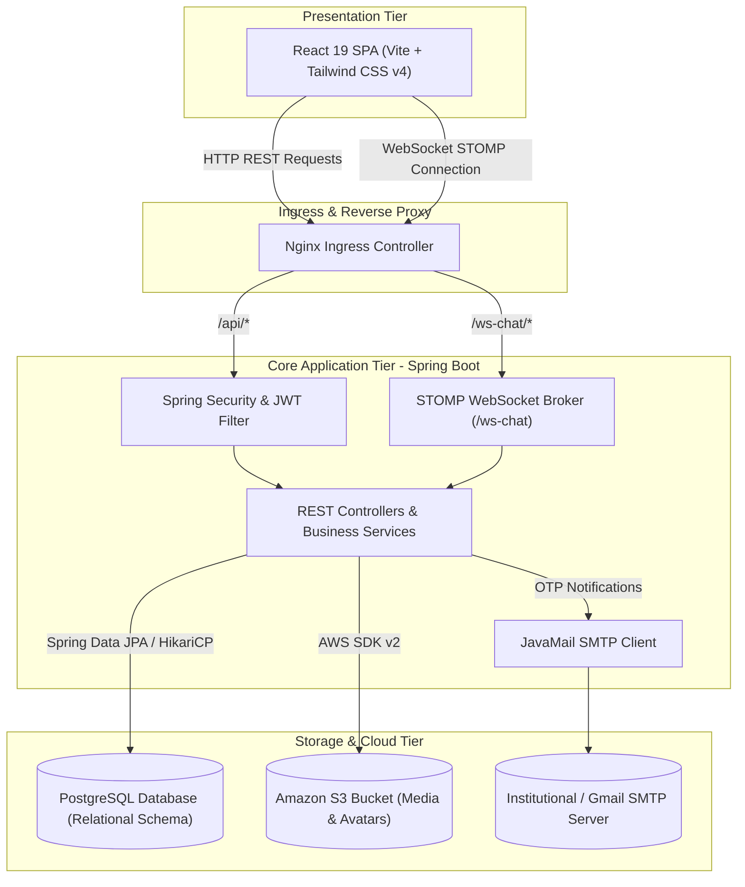

# RGUKT Connect 🎓🌐

> **Bridging the Gap Between Current Students and Alumni of RGUKT Basar**

[](https://www.oracle.com/java/)
[](https://spring.io/projects/spring-boot)
[](https://react.dev/)
[](https://vitejs.dev/)
[](https://tailwindcss.com/)
[](https://www.postgresql.org/)
[](https://aws.amazon.com/s3/)
[](https://kubernetes.io/)
[](https://www.docker.com/)

---

## 📌 Table of Contents

- [The Problem](#-the-problem)
- [The Solution: RGUKT Connect](#-the-solution-rgukt-connect)
- [Key Features](#-key-features)
- [System Architecture](#-system-architecture)
- [Technology Stack](#-technology-stack)
- [Repository Structure](#-repository-structure)
- [Getting Started & Local Setup](#-getting-started--local-setup)
  - [Prerequisites](#prerequisites)
  - [Database Setup](#1-database-setup)
  - [Backend Configuration & Execution](#2-backend-configuration--execution)
  - [Frontend Configuration & Execution](#3-frontend-configuration--execution)
- [Environment Variables](#-environment-variables)
- [API & WebSocket Specification](#-api--websocket-specification)
- [CI/CD & Deployment](#-cicd--deployment)
- [Documentation Deliverables](#-documentation-deliverables)
- [Contributing](#-contributing)
- [License](#-license)

---

## 🛑 The Problem

At **Rajiv Gandhi University of Knowledge Technologies (RGUKT) Basar**, thousands of students and accomplished alumni share a rich institutional background. However, **no single unified platform exists to bridge the gap between current students and alumni**. 

In the absence of a dedicated ecosystem, the university community suffers from significant communication deficits:

1. **Information Fragmentation & Noise**:
   - Interactions are scattered across ephemeral WhatsApp and Telegram groups that hit membership caps, split across branches and batches, and get saturated with casual chats and administrative noise.
2. **Verification Gap & Affiliation Spoofing**:
   - Open networks like LinkedIn lack institutional domain verification. Anyone can claim an RGUKT Basar affiliation, creating impersonation hazards, trust deficits, and phishing risks.
3. **Alumni Network Fatigue**:
   - Without an authenticated student directory, alumni on public social networks are flooded with cold, generic messages from strangers, causing high burnout and disengagement from legitimate campus juniors.
4. **The Job Referral Bottleneck**:
   - Resumes submitted through public portals frequently disappear into automated Applicant Tracking Systems (ATS). RGUKT alumni eager to refer juniors for active openings at their companies lack a centralized, verified board to post opportunities and review applicant profiles.
5. **Mentorship & Senior Discovery Barrier**:
   - Current students have no structured way to discover and filter seniors by graduation year, engineering branch (CSE, ECE, ME, CE, EEE, CHE, MME), current employer, or domain specialization.

---

## 💡 The Solution: RGUKT Connect

**RGUKT Connect** is an institutional networking, mentorship, and career acceleration platform built exclusively for the RGUKT Basar ecosystem. It solves the communication gap by pairing institutional identity validation with dedicated collaboration tools:

* **Strict Closed-Loop Authentication**: Registration requires an official `@rgukt.ac.in` email and a valid 7-character University ID, verified using timed 6-digit SMTP One-Time Passwords (OTP).
* **Searchable Member Directory**: Search across batches, departments, current job roles, and tech stacks to connect directly with the right seniors.
* **Verified Opportunities & Referral Board**: A dedicated board where alumni and administrators post active openings, marked with referral availability to fast-track student interview pipelines.
* **Real-Time STOMP Messaging**: Bi-directional private messaging restricted to accepted connections, protecting alumni from spam while enabling meaningful 1-on-1 mentorship.
* **Community Knowledge Feed**: A central university stream supporting rich media uploads to AWS S3, code snippets with syntax highlighting, and threaded discussions.

```
┌────────────────────────────────────────────────────────────────────────┐
│                          RGUKT CONNECT FLOW                            │
└────────────────────────────────────────────────────────────────────────┘
 [RGUKT Basar Student / Alum]
             │
             ▼
 [Domain & ID Verification] ──────> 6-Digit Email OTP Verification
             │
             ▼
   [Authenticated Session] ───────> JWT Access Token Issued
             │
   ┌─────────┼─────────────────────────┬────────────────────────┐
   ▼         ▼                         ▼                        ▼
[Feed]  [Directory]             [Job Board]              [Real-Time Chat]
Share    Search Seniors          Alumni Referrals &       STOMP over WS
Media    Connect Requests        Verified Openings        Direct Guidance
```

---

## ✨ Key Features

| Feature | Description |
| :--- | :--- |
| **🔒 Institutional Identity Verification** | Enforces `@rgukt.ac.in` domain and 7-character ID format. Issues temporary 6-digit OTPs via JavaMail SMTP with 5-minute validity. |
| **👥 Comprehensive  Directory** | Filter verified students and alumni by name, branch, batch, and company; send, accept, decline, or cancel connection invitations. |
| **💼 Job & Referral Board** | Role-restricted posting (Alumni & Admin only). Students browse verified jobs/internships and request direct employee referrals. |
| **💬 Real-Time Messaging** | Sub-protocol STOMP over WebSockets (`ws://`) with custom JWT handshake interceptors, message queuing, unread counts, and audio alerts. |
| **📰 Community Feed** | Post updates, rich media (images and videos uploaded to AWS S3), and code snippets; includes real-time like toggles and nested comments. |
| **👤 Rich Dynamic Profiles** | Showcase academic milestones, work experience, projects, skills, and links (GitHub, LinkedIn). Automated S3 upload and cleanup of profile avatars. |
| **🛡️ Role-Based Access Control (RBAC)** | Fine-grained authorizations across `STUDENT`, `ALUMNI`, and `ADMIN` roles powered by Spring Security. |

---

## 🏛️ System Architecture

RGUKT Connect uses a decoupled, three-tier architecture containerized for cloud deployment:



---

## 🛠️ Technology Stack

### Frontend
- **Framework**: [React 19](https://react.dev/)
- **Bundler & Tooling**: [Vite 8](https://vitejs.dev/)
- **Styling**: [Tailwind CSS v4](https://tailwindcss.com/)
- **State & Routing**: [React Router DOM v7](https://reactrouter.com/)
- **Icons**: [Lucide React](https://lucide.dev/)
- **HTTP Client**: [Axios](https://axios-http.com/)
- **Real-Time Client**: [`@stomp/stompjs`](https://github.com/stomp-js/stompjs)

### Backend
- **Runtime**: [Java 21 (JDK 21 LTS)](https://www.oracle.com/java/)
- **Framework**: [Spring Boot 4 / 3.4](https://spring.io/projects/spring-boot)
- **Security**: Spring Security with JJWT (`io.jsonwebtoken 0.11.5`)
- **Data Access**: Spring Data JPA & Hibernate ORM with HikariCP
- **Real-Time Protocol**: Spring WebSocket with STOMP sub-protocol
- **Cloud SDK**: AWS SDK for Java 2.x (S3 Client)
- **Mailing**: Spring Boot Starter Mail (SMTP)
- **Boilerplate Reduction**: Project Lombok

### Database & Cloud
- **Primary Database**: PostgreSQL 15/16 (Relational Schema)
- **Object Storage**: Amazon Web Services (AWS) S3
- **Email Delivery**: SMTP (Gmail / Institutional Relay)

### DevOps & Infrastructure
- **Containerization**: Docker (Multi-stage build with `maven:3.9.9` and `eclipse-temurin:21-jre`)
- **Orchestration**: Kubernetes (Deployments, NodePort Services, Ingress, Rolling Updates)
- **CI/CD Pipeline**: Jenkins Declarative Pipeline (`Jenkinsfile`)
- **Frontend Hosting**: Vercel (`vercel.json`)

---

## 📁 Repository Structure

```
rgukt-connect/
├── backend/                              # Spring Boot Java Application
│   ├── src/
│   │   ├── main/
│   │   │   ├── java/com/uday/rguktconnect/
│   │   │   │   ├── config/              # Security, AWS, WebSocket, CORS configuration
│   │   │   │   ├── controller/          # REST endpoints (Auth, User, Post, Job, Chat)
│   │   │   │   ├── dto/                 # Request & Response payload transfer objects
│   │   │   │   ├── entity/              # JPA Data Models (User, Post, Job, Message, etc.)
│   │   │   │   ├── exception/           # Global exception handlers
│   │   │   │   ├── repository/          # Spring Data JPA interfaces
│   │   │   │   ├── security/            # JWT Token provider & auth filters
│   │   │   │   └── service/             # Business logic & email services
│   │   │   └── resources/
│   │   │       └── application.properties # Spring configuration & env bindings
│   ├── k8s/                             # Kubernetes manifests
│   │   ├── deployment.yaml              # Pod specs, replicas, probes, and resource limits
│   │   ├── service.yaml                 # NodePort service configuration
│   │   └── ingress.yaml                 # Ingress path routing for REST and WebSockets
│   ├── Dockerfile                       # Multi-stage container build definition
│   ├── Jenkinsfile                      # 10-stage automated CI/CD pipeline
│   └── pom.xml                          # Maven build dependencies
│
├── frontend/                             # React 19 Single Page Application
│   ├── src/
│   │   ├── components/                  # Navbar, Modals, Feed cards, Post creators
│   │   ├── context/                     # Auth and WebSocket global contexts
│   │   ├── pages/                       # Landing, Login, Register, Home, Network, Jobs, Chat, Profile
│   │   ├── utils/                       # Axios interceptors, formatters, helpers
│   │   ├── App.jsx                      # Route definitions & guards
│   │   └── main.jsx                     # Application entry point
│   ├── package.json                     # Frontend dependencies & npm scripts
│   ├── vite.config.js                   # Vite configuration with Tailwind plugin
│   └── vercel.json                      # Vercel deployment routing rules
│
├── rgukt-connect-documentation/         # LaTeX Academic & Technical Documentation
│   ├── chapters/                        # 20+ modular LaTeX chapters
│   ├── main.tex                         # Master LaTeX document
│   ├── references.bib                   # Academic citations & references
│   └── README.md                        # PDF compilation instructions
│
└── README.md                            # Project documentation (this file)
```

---

##  Getting Started & Local Setup

Follow these steps to run the complete RGUKT Connect platform on your local machine.

### Prerequisites
- **Java**: JDK 21 installed (`java -version`)
- **Maven**: 3.9+ installed or use the included `./mvnw`
- **Node.js**: v20.x or higher and npm (`node -v`, `npm -v`)
- **PostgreSQL**: v15 or v16 running locally or via Docker
- **AWS S3 Bucket**: S3 bucket with access key and secret
- **SMTP Credentials**: Gmail App Password or institutional SMTP credentials

---

### 1. Database Setup

Create a PostgreSQL database for the application:

```sql
CREATE DATABASE rgukt_connect;
```

---

### 2. Backend Configuration & Execution

1. Navigate to the backend directory:
   ```bash
   cd backend
   ```

2. Export the required environment variables:
   ```bash
   export DB_URL=jdbc:postgresql://localhost:5432/rgukt_connect
   export DB_USERNAME=postgres
   export DB_PASSWORD=your_password
   export JWT_SECRET=your_super_secret_jwt_key_at_least_256_bits_long
   export JWT_ACCESS_TOKEN_EXPIRATION=86400000
   export JWT_REFRESH_TOKEN_EXPIRATION=604800000
   export AWS_ACCESS_KEY_ID=your_aws_access_key
   export AWS_SECRET_ACCESS_KEY=your_aws_secret_key
   export AWS_REGION=ap-south-1
   export AWS_BUCKET_NAME=your_rgukt_connect_bucket
   export MAIL_USERNAME=your_email@gmail.com
   export MAIL_PASSWORD=your_app_specific_password
   export CORS_ALLOWED_ORIGINS=http://localhost:5173,http://localhost:3000
   ```

   > [!TIP]
   > **Development Testing Shortcut**: When testing registration or password recovery without an SMTP server, register with an email starting with the prefix `test` (e.g., `teststudent@rgukt.ac.in`). The backend will automatically bypass email sending and accept the fixed OTP **`123456`**.

3. Build and launch the Spring Boot server:
   ```bash
   # Using Maven wrapper
   ./mvnw clean spring-boot:run
   ```
   The backend server will start on `http://localhost:8000`. You can verify health at `http://localhost:8000/api/auth/health`.

---

### 3. Frontend Configuration & Execution

1. Navigate to the frontend directory:
   ```bash
   cd ../frontend
   ```

2. Configure the environment:
   Ensure `frontend/.env` points to your backend instance:
   ```env
   VITE_API_URL=http://localhost:8000
   ```

3. Install dependencies:
   ```bash
   npm install
   ```

4. Launch the Vite development server:
   ```bash
   npm run dev
   ```
   Open your browser and navigate to `http://localhost:5173`.

---

## ⚙️ Environment Variables

### Backend Configuration (`backend/src/main/resources/application.properties`)

| Variable | Description | Default / Example |
| :--- | :--- | :--- |
| `DB_URL` | PostgreSQL JDBC connection URL | `jdbc:postgresql://localhost:5432/rgukt_connect` |
| `DB_USERNAME` | PostgreSQL database user | `postgres` |
| `DB_PASSWORD` | PostgreSQL database password | `secret` |
| `JWT_SECRET` | Secret key for signing and validating JWTs | `AtLeast256BitKeyString` |
| `JWT_ACCESS_TOKEN_EXPIRATION` | Access token time-to-live in ms | `86400000` (24 Hours) |
| `JWT_REFRESH_TOKEN_EXPIRATION`| Refresh token time-to-live in ms | `604800000` (7 Days) |
| `AWS_ACCESS_KEY_ID` | AWS IAM access key ID | `AKIA...` |
| `AWS_SECRET_ACCESS_KEY` | AWS IAM secret access key | `...` |
| `AWS_REGION` | AWS S3 region | `ap-south-1` |
| `AWS_BUCKET_NAME` | S3 bucket name for avatars & media | `rgukt-connect-bucket` |
| `MAIL_USERNAME` | SMTP sender email address | `example@gmail.com` |
| `MAIL_PASSWORD` | SMTP app-specific password | `xxxx xxxx xxxx xxxx` |
| `CORS_ALLOWED_ORIGINS` | Permitted client origins | `http://localhost:5173,http://localhost:3000` |

### Frontend Configuration (`frontend/.env`)

| Variable | Description | Default / Example |
| :--- | :--- | :--- |
| `VITE_API_URL` | Base URL for Spring Boot REST & WebSocket endpoint | `http://localhost:8000` |

---

## 📡 API & WebSocket Specification

### Key REST Endpoints

#### Authentication & Onboarding
* `GET  /api/auth/health` — Service readiness & liveness probe
* `POST /api/auth/register/send-otp` — Sends a 6-digit verification code to the user's `@rgukt.ac.in` address
* `POST /api/auth/register` — Validates OTP, creates verified account (`STUDENT`, `ALUMNI`)
* `POST /api/auth/login` — Authenticates credentials and returns a Bearer JWT token
* `POST /api/auth/forgot-password/send-otp` — Generates a recovery OTP
* `POST /api/auth/forgot-password/verify` — Verifies recovery OTP and resets account password

#### User & Profile Management
* `GET  /api/users/profile` — Retrieves the authenticated profile
* `PUT  /api/users/profile` — Updates personal info, branch, batch, description, social links
* `POST /api/users/profile/avatar` — Uploads user avatar to AWS S3 and purges outdated image
* `GET  /api/users/directory` — Searches all verified members excluding the caller

#### Connections & Networking
* `GET  /api/connections/status/{userId}` — Returns relationship status (`NOT_CONNECTED`, `PENDING_SENT`, `PENDING_RECEIVED`, `ACCEPTED`)
* `POST /api/connections/request/{receiverId}` — Dispatches a new connection request
* `PUT  /api/connections/accept/{requestId}` — Accepts an incoming connection request
* `DELETE /api/connections/cancel/{connectionId}` — Withdraws or rejects an invitation

#### Opportunities & Job Board
* `GET  /api/jobs` — Lists active job openings and internship listings
* `POST /api/jobs` — Publishes a new listing (*Requires role `ALUMNI` or `STUDENT`*)
* `DELETE /api/jobs/{id}` — Deletes an active listing (*Owner or Admin only*)

#### Posts & Community Feed
* `GET  /api/posts` — Fetches global community post feed
* `POST /api/posts` — Creates a post with text, code block, and S3 media attachment
* `POST /api/posts/{id}/like` — Toggles like state
* `POST /api/posts/{id}/comment` — Adds a comment to a post

---

### Real-Time WebSocket Communication

The platform uses **STOMP over WebSocket** for bi-directional live events:

* **Endpoint**: `ws://<HOST>:8000/ws-chat/websocket`
* **Handshake**: Authenticated with `Authorization: Bearer <token>` in connection headers.
* **Channels**:
  * `/user/queue/messages` — Delivers private 1-on-1 messages from connections.
  * `/user/queue/notifications` — Delivers live relationship and referral updates.
* **Publishing**: Messages sent to `/api/chat/send` are persisted in PostgreSQL and pushed instantly to the recipient's active STOMP queue.

---

## 🚢 CI/CD & Deployment

### 1. Docker Multi-Stage Build
The backend uses an optimized two-stage Docker build to keep images lightweight and secure:

```bash
# Build Docker image
docker build -t udayangari/rgukt-connect-backend:latest ./backend

# Run container locally
docker run -d -p 8000:8000 --env-file ./backend/.env udayangari/rgukt-connect-backend:latest
```

### 2. Kubernetes Orchestration (`backend/k8s`)
The production backend runs on a replicated Kubernetes cluster:
* **Zero-Downtime Deployments**: Configured with a `RollingUpdate` strategy (`maxSurge: 1`, `maxUnavailable: 0`).
* **Health Probes**: Integrated readiness probe (`initialDelaySeconds: 90`) and liveness probe (`initialDelaySeconds: 120`) checking `/api/auth/health`.
* **Ingress Routing**:
  * `/api/*` requests routed to `backend-service:8000`.
  * `/ws-chat/*` upgraded and routed directly for persistent WebSocket streams.

### 3. Automated Jenkins Pipeline
The root `backend/Jenkinsfile` automates the continuous deployment pipeline:
1. Git checkout & environment verification
2. Docker Hub authentication
3. Automated compilation & Docker image building
4. Push image to registry
5. Rolling restart of containers on target host
6. Automated health poll verification (30 retries over 60 seconds)

---

## 📚 Documentation Deliverables

For institutional reporting, code review, and architectural audits, this repository includes a complete **20+ chapter academic-grade LaTeX documentation suite** in [`rgukt-connect-documentation`](./rgukt-connect-documentation):

```bash
cd rgukt-connect-documentation

# Compile LaTeX deliverable into PDF
pdflatex -interaction=nonstopmode -output-directory=build main.tex
bibtex build/main
pdflatex -interaction=nonstopmode -output-directory=build main.tex
pdflatex -interaction=nonstopmode -output-directory=build main.tex
```
The resulting document is generated at `rgukt-connect-documentation/build/RGUKT-Connect-Documentation.pdf`.

---

## 🤝 Contributing

Contributions from the RGUKT Basar community are warmly welcome!

1. Fork the repository.
2. Create your Feature Branch (`git checkout -b feature/AmazingFeature`).
3. Commit your changes (`git commit -m 'Add some AmazingFeature'`).
4. Push to the branch (`git push origin feature/AmazingFeature`).
5. Open a Pull Request.

---

## 📄 License

This project is licensed under the [MIT License](LICENSE).
